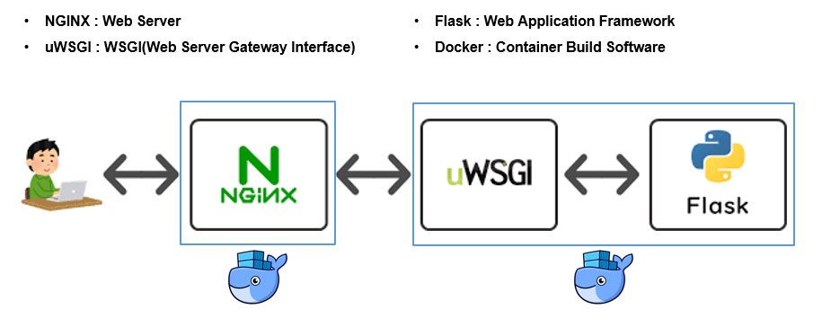

# Model-API
[](https://www.python.org/downloads/release/python-360/)

**Model-API**는 학습된 Word2Vec 모델을 서빙한 프로젝트입니다.

## Tables

* [Architecture diagram](#architecture-diagram)
* [Prerequisites](#prerequisites)
* [Model information](#model-information)
* [Running project](#running-project)
* [API service](#api-service)

## Architecture Diagram


## Prerequisites
프로젝트를 실행시키기 위해 필요한 소프트웨어.

### Install:
- [Docker](https://docs.docker.com/get-docker/)
- [Python 3.9+ (pip)](https://www.python.org/)
- [docker-compose](https://docs.docker.com/compose/install/)

## Model information
- [Raw Data](https://dumps.wikimedia.org/kowiki/latest/kowiki-latest-pages-articles.xml.bz2)
- [Data Processing](https://github.com/mungiyo/wikitext_nouns_extractor.git)
- Model Shape

```sh
(148481, 100)
```

## Running Project
`manage.sh` 스크립트는 `docker-compose`를 작동시키기 위한 관리 도구입니다.

- Build project infrastructure

```sh
./manage.sh start
```

- Stop project infrastructure

```sh
./manage.sh stop
```

- Down project infrastructure

```sh
./manage.sh down
```

## API service
프로젝트를 실행시켰을 때 사용할 수 있는 API 입니다.

지원하는 **Method**는 **GET** 방식만 지원하며, **Header**는 **application/json** 만 지원합니다.

### Example:
- 'word'라는 단어로 Request

  - **Request**
  ```
  http://localhost/predict/word
  ```
  - **Response 1** : 관련된 단어 5개를 Response 함.
  ```
  {
    status: 1,
    result: [
      word1,
      word2,
      word3,
      word4,
      word5
    ]
  }
  ```
  - **Response 2** : 관련된 단어를 찾을 수 없음. (out of vocabulary)
  ```
  {
    status: 0,
    result: 'Out of Vocabulary'
  }
